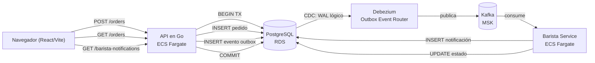
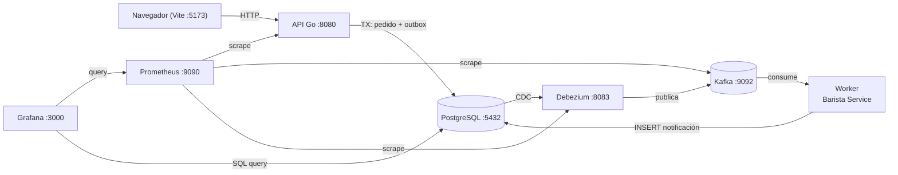

[English](README.md) | [Español](README.es.md)

# BrewRelay

App web de pedidos de cafetería que demuestra el **patrón Outbox** con **Debezium** y **Kafka** de punta a punta. Frontend React/Vite, API en Go, worker en Go (Barista Service), infraestructura Terraform/Terragrunt y despliegues con GitHub Actions.

Licenciado bajo la [Licencia Apache 2.0](LICENSE).

## Arquitectura

Cuatro límites explícitos: el frontend posee el flujo de pedidos, la API posee la creación de pedidos y la persistencia transaccional de eventos, el worker posee el consumo de eventos y las notificaciones del barista, y la infraestructura posee el despliegue, aislamiento y observabilidad.



El concepto clave: el **Outbox no reemplaza a Kafka** — lo complementa. La tabla outbox (`outbox_events`) guarda el evento de forma confiable en la misma transacción de base de datos que el pedido. Debezium captura el cambio vía CDC (replicación lógica) y lo publica en Kafka. El Barista Service consume el evento y registra una notificación. Esto evita el problema de la doble escritura: si la API publicara directo a Kafka y se cayera entre el INSERT y el produce, el sistema quedaría inconsistente.

### Frontend — React + Vite

`apps/frontend/src` (React 19 + Vite + Tailwind CSS + shadcn/ui + Framer Motion):

- **Página Carta**: catálogo de bebidas desde `GET /menu`, carrito lateral con checkout, tracking de pedidos con hitos reales de estado (Creado → Preparando → Listo).
- **Página Cocina**: tablero del barista en tiempo real con tickets agrupados por estado (Nuevos, Preparando, Listos). El barista avanza el estado vía `PATCH /orders/{id}/status`.
- **Página Cómo funciona**: diagrama educativo del flujo Outbox → Debezium → Kafka.

### API — Go

`apps/api` (Go, ECS Fargate + ALB). Endpoints:

- `GET /menu` — catálogo de bebidas con precios por tamaño.
- `POST /orders` — crea pedido + evento outbox en una transacción, calcula total.
- `GET /orders` — lista todos los pedidos con estado.
- `PATCH /orders/{id}/status` — el barista avanza el estado (CREATED → PREPARING → READY → DELIVERED).
- `GET /barista-notifications` — historial de eventos del barista.
- `GET /health` — health check.
- `GET /metrics` — métricas Prometheus (pedidos, notificaciones, pedidos por estado).

### Worker — Barista Service (Go)

`apps/worker` (Go, ECS Fargate). Consume el topic `coffee.orders` de Kafka, parsea eventos `OrderCreated`, e inserta una fila de notificación en `barista_notifications`. El worker también avanza el estado del pedido cuando el barista actúa vía la API.

### Infraestructura — Runtime y entrega en AWS

Aprovisionada con módulos Terraform (`infra/blueprints/modules`) y stacks live de Terragrunt (`infra/terraform`). GitHub Actions construye, testea y despliega frontend, imágenes de API y worker, y cambios de infraestructura.

- **S3 + CloudFront** entregan el frontend (OAC, SPA fallback).
- **ECS Fargate** ejecuta la API y el worker desde ECR.
- **ALB** expone la API en el puerto 80 con health checks.
- **RDS PostgreSQL** con `rds.logical_replication = 1` para CDC de Debezium.
- **Amazon MSK** provee el cluster de Kafka.
- **MSK Connect** ejecuta el conector Debezium.
- **CloudWatch** captura logs, alarmas y un dashboard de operaciones.
- **IAM OIDC** permite que GitHub Actions despliegue sin claves de larga duración.

## Estructura del repositorio

- `apps/frontend`: UI de pedidos React + TypeScript + Vite gestionada con Bun.
- `apps/api`: API en Go para pedidos, menú, transiciones de estado y notificaciones del barista.
- `apps/worker`: consumer Kafka en Go (Barista Service) que procesa eventos `OrderCreated`.
- `infra/blueprints`: módulos Terraform reutilizables y bootstrap de estado remoto.
- `infra/terraform`: stacks live de Terragrunt organizados en `shared/` (VPC, RDS, MSK, observabilidad, IAM) y `services/` (ECR, ECS, frontend).
- `.github/workflows`: CI/CD para infra, frontend y backend.
- `.github/scripts`: helpers de bootstrap, cleanup y resolución de CORS.
- `docs/`: guías de arquitectura, flujo, decisiones, conector Debezium y despliegue AWS.

## Uso local

```bash
docker compose up -d --build
```

El sistema completo corre localmente en Docker Compose: PostgreSQL (con replicación lógica), Kafka (modo KRaft), Kafka Connect (conector Debezium auto-registrado), API, worker, frontend y observabilidad (Prometheus + Grafana).



1. Abrí http://localhost:5173 para ver la carta.
2. Agregá bebidas al carrito, escribí tu nombre y enviá el pedido.
3. El pedido aparece en "Tus pedidos" con el hito "Creado".
4. Andá a la pestaña "Cocina" — el ticket aparece en la columna "Nuevos".
5. Hacé clic en "Empezar a preparar" — el pedido pasa a "Preparando".
6. Volvé a "Carta" — el tracking muestra "Preparando" completado.
7. Hacé clic en "Marcar como listo" en la cocina — el pedido está listo.
8. Revisá Grafana en http://localhost:3000 (admin/admin) para ver las métricas.

El conector Debezium se auto-registra al arrancar el contenedor `kafka-connect` (es idempotente). Para re-registrarlo manualmente:

```bash
./docker/debezium/register-connector.sh
```

## Límites MVP

- Bebidas: Latte, Americano, Cappuccino, Mocha, Espresso.
- Tamaños: Small, Medium, Large.
- Tipo de evento único: `OrderCreated`.
- Consumidor único: Barista Service.
- Sin login, pagos, inventario, roles ni panel administrativo.

## Deploy

1. Configurá `AWS_ROLE_ARN` (OIDC) y `DB_PASSWORD` como secrets del repositorio. `AWS_REGION` está fija como `us-east-1` en los workflows.
2. Ejecutá `.github/workflows/infra-lifecycle.yml` con `plan` o `apply`. Hace bootstrap del bucket de estado Terraform y la tabla de lock en DynamoDB si no existen. Los flows de destroy detienen tareas ECS y vacían buckets S3/ECR antes de que Terragrunt destruya los stacks.
3. Desplegá el backend con `.github/workflows/backend-deploy.yml`. En push a `main`, detecta cambios de rutas y despliega solo los componentes afectados (API y/o worker) como imágenes Docker a ECR, luego aplica la task definition de ECS.
4. Desplegá el frontend con `.github/workflows/frontend-deploy.yml`. Construye con Bun, sincroniza a S3 e invalida CloudFront.
5. `.github/workflows/destroy-infra-scheduled.yml` ejecuta un cron semanal (domingos 03:00 UTC) para destruir el entorno dev y contener costos.

Los módulos Terraform usan buckets S3 privados, CloudFront OAC, replicación lógica de RDS, cifrado de MSK, aislamiento ECS Fargate, alarmas de CloudWatch e IAM OIDC para deploys sin claves.