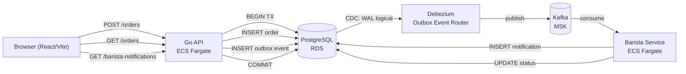
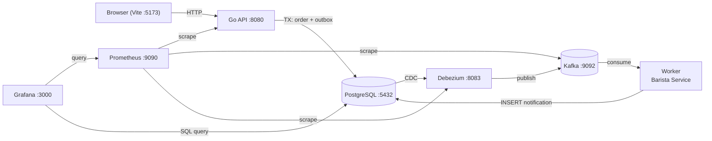

[English](README.md) | [Español](README.es.md)

# BrewRelay

Coffee ordering web app that demonstrates the **Outbox pattern** with **Debezium** and **Kafka** end-to-end. React/Vite frontend, Go API, Go worker (Barista Service), Terraform/Terragrunt infrastructure, and GitHub Actions deployments.

Licensed under the [Apache License 2.0](LICENSE).

## Architecture

Four explicit boundaries: frontend owns the ordering workflow, API owns order creation and transactional event persistence, worker owns event consumption and barista notifications, infrastructure owns deployment, isolation, and observability.



The key insight: the **Outbox does not replace Kafka** — it complements it. The outbox table (`outbox_events`) stores the event reliably in the same database transaction as the order. Debezium captures the change via CDC (logical replication) and publishes it to Kafka. The Barista Service consumes the event and records a notification. This avoids the dual-write problem: if the API published directly to Kafka and crashed between the INSERT and the produce, the system would be inconsistent.

### Frontend — React + Vite

`apps/frontend/src` (React 19 + Vite + Tailwind CSS + shadcn/ui + Framer Motion):

- **Menu page**: drink catalog from `GET /menu`, cart drawer with checkout, order tracking with real status milestones (Created → Preparing → Ready).
- **Kitchen page**: real-time barista board with order tickets grouped by status (New, Preparing, Ready). Barista advances status via `PATCH /orders/{id}/status`.
- **How it works page**: educational diagram of the Outbox → Debezium → Kafka flow.

### API — Go

`apps/api` (Go, ECS Fargate + ALB). Endpoints:

- `GET /menu` — drink catalog with prices per size.
- `POST /orders` — creates order + outbox event in one transaction, calculates total.
- `GET /orders` — lists all orders with status.
- `PATCH /orders/{id}/status` — barista advances status (CREATED → PREPARING → READY → DELIVERED).
- `GET /barista-notifications` — barista event history.
- `GET /health` — health check.
- `GET /metrics` — Prometheus metrics (orders, notifications, orders by status).

### Worker — Barista Service (Go)

`apps/worker` (Go, ECS Fargate). Consumes `coffee.orders` Kafka topic, parses `OrderCreated` events, and inserts a notification row into `barista_notifications`. The worker also advances the order status when the barista acts via the API.

### Infrastructure — AWS Runtime and Delivery

Provisioned with Terraform modules (`infra/blueprints/modules`) and Terragrunt live stacks (`infra/terraform`). GitHub Actions builds, tests, and deploys frontend, API, worker images, and infrastructure changes.

- **S3 + CloudFront** deliver the frontend (OAC, SPA fallback).
- **ECS Fargate** runs the API and worker from ECR.
- **ALB** exposes the API on port 80 with health checks.
- **RDS PostgreSQL** with `rds.logical_replication = 1` for Debezium CDC.
- **Amazon MSK** provides the Kafka cluster.
- **MSK Connect** runs the Debezium connector.
- **CloudWatch** captures logs, alarms, and an operations dashboard.
- **IAM OIDC** allows GitHub Actions to deploy without long-lived keys.

## Repository Layout

- `apps/frontend`: Bun-managed React + TypeScript + Vite ordering UI.
- `apps/api`: Go API for orders, menu, status transitions, and barista notifications.
- `apps/worker`: Go Kafka consumer (Barista Service) that processes `OrderCreated` events.
- `infra/blueprints`: reusable Terraform modules and remote-state bootstrap.
- `infra/terraform`: Terragrunt live stacks organized into `shared/` (VPC, RDS, MSK, observability, IAM) and `services/` (ECR, ECS, frontend).
- `.github/workflows`: CI/CD for infra, frontend, and backend deploys.
- `.github/scripts`: bootstrap, cleanup, and CORS resolution helpers.
- `docs/`: architecture, flow, decisions, Debezium connector, and AWS deployment guides.

## Local Usage

```bash
docker compose up -d --build
```

The full system runs locally on Docker Compose: PostgreSQL (with logical replication), Kafka (KRaft mode), Kafka Connect (Debezium connector auto-registered), API, worker, frontend, and observability (Prometheus + Grafana).



1. Open http://localhost:5173 to see the menu.
2. Add drinks to the cart, enter your name, and send the order.
3. The order appears in "Tus pedidos" with the "Creado" milestone.
4. Go to the "Cocina" tab — the ticket appears in the "Nuevos" column.
5. Click "Empezar a preparar" — the order moves to "Preparando".
6. Return to "Carta" — the tracking shows "Preparando" completed.
7. Click "Marcar como listo" in the kitchen — the order is ready.
8. Check Grafana at http://localhost:3000 (admin/admin) for metrics.

The Debezium connector is auto-registered by the `kafka-connect` container on startup (idempotent). To re-register manually:

```bash
./docker/debezium/register-connector.sh
```

## MVP Limits

- Drinks: Latte, Americano, Cappuccino, Mocha, Espresso.
- Sizes: Small, Medium, Large.
- Single event type: `OrderCreated`.
- Single consumer: Barista Service.
- No login, payments, inventory, roles, or admin panel.

## Deploy

1. Configure `AWS_ROLE_ARN` (OIDC) and `DB_PASSWORD` as repository secrets. `AWS_REGION` is fixed as `us-east-1` in workflows.
2. Run `.github/workflows/infra-lifecycle.yml` with `plan` or `apply`. Bootstraps the Terraform state bucket and DynamoDB lock table if missing. Destroy flows stop ECS tasks and empty S3/ECR before Terragrunt destroys stacks.
3. Deploy backend through `.github/workflows/backend-deploy.yml`. On push to `main`, it detects path changes and deploys only the affected components (API and/or worker) as Docker images to ECR, then applies the ECS task definition.
4. Deploy frontend through `.github/workflows/frontend-deploy.yml`. Builds with Bun, syncs to S3, and invalidates CloudFront.
5. `.github/workflows/destroy-infra-scheduled.yml` runs a weekly cron (Sundays 03:00 UTC) to destroy the dev environment and contain costs.

Terraform modules use private S3 buckets, CloudFront OAC, RDS logical replication, MSK encryption, ECS Fargate isolation, CloudWatch alarms, and IAM OIDC for keyless deploys.